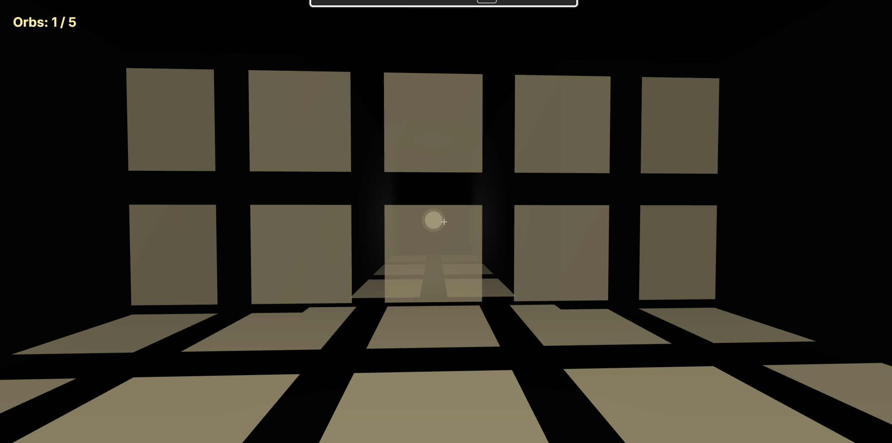
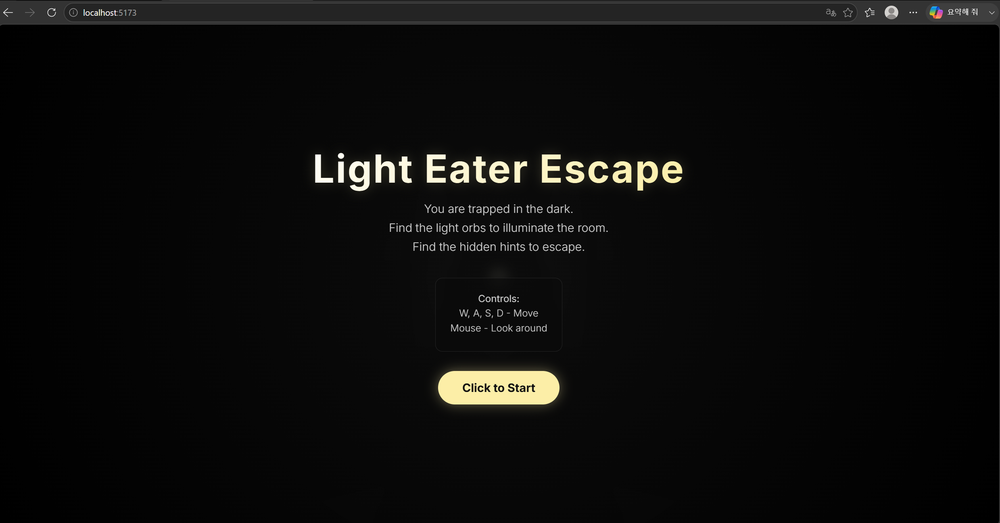
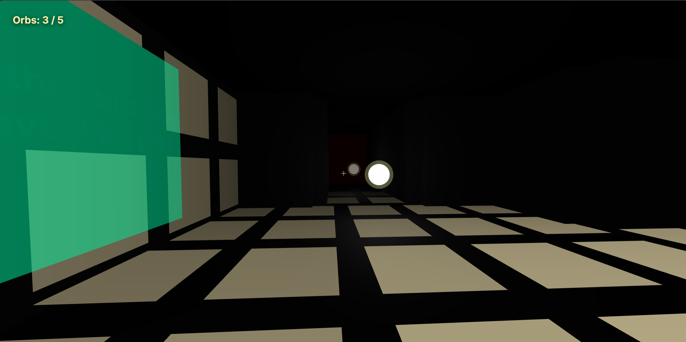
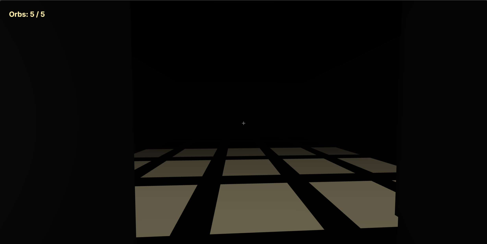
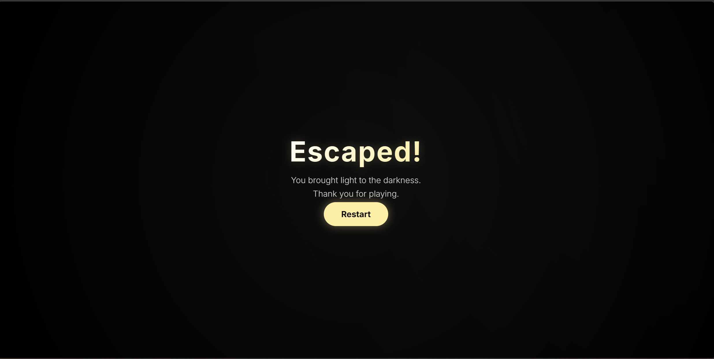
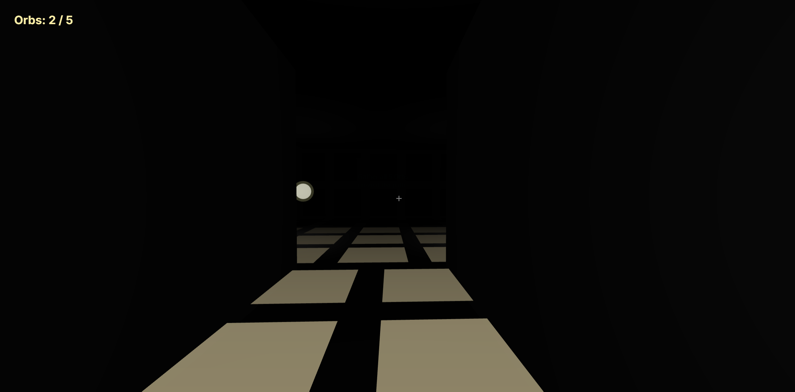
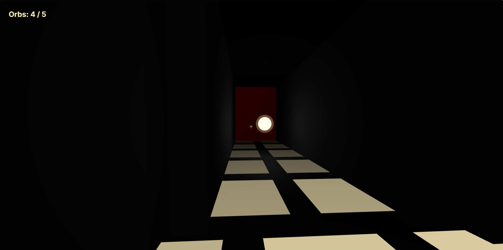

# Light Eater Escape

## 게임 개요
`Light Eater Escape`는 완전히 어두운 방에서 시작하여 맵에 존재하는 빛 오브(Orb)를 획득하여 주변 공간을 밝히고, 숨겨진 힌트를 찾아 탈출하는 3D 방탈출 게임입니다.

*(그림 1: 게임 시작 직후 스폰되는 매우 어두운 방해 환경)*

---

## 🕹 조작 방법
- **W, A, S, D**: 전후좌우 이동 (1인칭 시점)
- **마우스 이동**: 시점(카메라) 회전
- **클릭**: 게임 시작 및 마우스 화면 고정 (Pointer Lock)

*(그림 2: 마우스 클릭 안내 및 조작 방법이 표기된 시작 화면 UI)*

---

## 🏃 게임 진행 방식 및 클리어 조건
1. 시야 확보를 위해 아주 약한 개인 손전등만 주어집니다.
2. 빛이 나는 오브(Orb)에 접근하면 오브를 획득할 수 있습니다. (맵 전체에 총 5개)
3. 방이 충분히 밝아지면 어둠 속에 감춰져 있던 벽의 힌트(방향, 지시사항 등)가 발광하며 나타납니다.

*(그림 3: 맵 탐색 중 숨겨진 힌트와 빛 오브를 발견한 장면)*

4. 힌트를 따라 맵을 탐색하고 **5개의 오브를 모두 모으면 굳게 닫혀 있던 동쪽의 최종 탈출문(Final Door)이 열립니다.**
5. 열린 탈출문 구역으로 진입하면 게임 클리어 화면이 나타나며 탈출에 성공합니다.

*(그림 4: 5개의 오브를 모아 조건이 달성되어 탈출문이 사라지고 통과 가능한 상태)*

*(그림 5: 최종 구역에 진입하여 탈출에 성공한 결과 화면)*

---

## 💡 강의에서 배운 GI 내용과 구현 내용 매핑
강의에서 다룬 Global Illumination(GI)의 핵심은 광원에서 나온 빛이 표면에서 한 번 이상 반사되어 주변을 간접적으로 밝히는 원리입니다. 본 프로젝트에서는 연산량이 매우 큰 실시간 Path Tracing을 피하고, 이를 근사적으로 흉내내는 가짜 GI(Fake GI) 방식인 **SurfelGI** 방식을 구현하였습니다. 

*(그림 6: 광원(빛 오브)이 존재하는 공간에서의 빛 발산)*

- **이론적 배경**: 표면에 도달한 빛이 반사되는 지점을 작은 디스크 조각(Surfel)으로 간주하고, 이들이 모여 2차 발광원 역할을 하는 개념.
- **실제 적용**: 맵의 벽과 바닥에 다수의 `SurfelPoint`(발광 가능한 Plane Mesh)를 격자 형태로 배치해 두고, 빛 오브를 획득할 때마다 주변 SurfelPoint들의 밝기(Brightness 및 Opacity/Color)를 증가시켜 표면 자체가 빛을 머금고 퍼뜨리는 GI 현상을 모방했습니다.

---

## 🛠 SurfelGI 구현 코드 설명
실제 코드 구현 방식은 렉(Lag)을 방지하고 웹 환경에서의 최적화를 달성하기 위해, 무거운 실제 조명(PointLight)을 다수 생성하는 것을 생략하고 Material의 속성을 조작하는 방식으로 완성되었습니다.

*(그림 7: 빛을 획득한 직후, 바닥과 벽에 배치된 SurfelPoint들이 반사광 역할을 하여 밝아지는 간접광 구현 장면)*

- **`SurfelPoint`**: 빛을 반사하는 지점을 표현하기 위해 `PlaneGeometry`와 투명도가 있는 `MeshBasicMaterial`을 결합한 메시입니다. 표면의 노멀(Normal) 벡터 방향을 바라보게(lookAt) 배치되어 바닥이나 벽에 얇게 밀착됩니다.
- **최적화**: 수십 개의 광원을 연산하는 대신, `brightness` 값에 따라 메시 자체의 색상(`Color.lerpColors`)과 불투명도(`opacity`)를 조작하여 표면이 스스로 빛을 방출하는 듯한 느낌을 줍니다.
- **`updateSurfelLighting()`**: 플레이어가 오브를 획득하면, 해당 오브 위치(광원 발생점)를 기준으로 특정 반경(radius) 내에 있는 `SurfelPoint`들과의 거리를 계산합니다. 거리가 가까울수록 가중치(Falloff)를 높게 적용하여 주변 Surfel들의 `brightness`를 점진적으로 증가시켜 빛이 은은하게 퍼지는 효과를 완성했습니다.

---

## 🌐 최종 점검 및 실행 링크
본 프로젝트는 요구사항에 맞춰 GitHub Pages를 통해 정상적으로 구동되도록 최적화되었습니다.

## 제출 링크

- 게임 실행 링크: https://jaegi9418-tech.github.io/light-eater-escape/
- 리포트 링크: https://github.com/jaegi9418-tech/light-eater-escape/blob/main/REPORT.md

- **조작 방법**: W, A, S, D (이동) / 마우스 (시점 회전) / 좌클릭 (시작)
- **클리어 조건**: 맵에 있는 5개의 오브를 모두 모아 숨겨진 힌트를 활성화하고 최종 탈출구에 도달
